## 项目介绍
>识别银行卡卡号

### 先建立数字模板（观察银行卡数字，做出与之相匹配的数字模板）

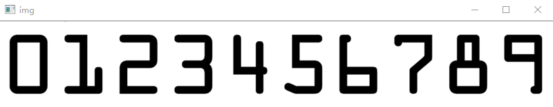

1. 对数字模板进行处理(模板的图片中看着黑白，所以跳过灰度处理，直接进行二值化处理就行)

2. 轮廓检测（提取外轮廓）

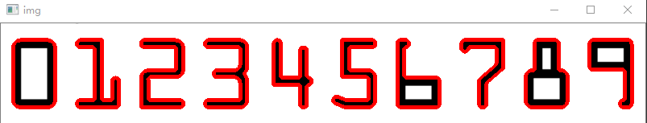

这样，就得到想要的数字模板

### 读取银行卡
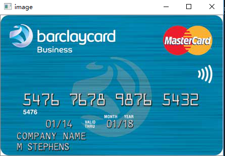

* 银行卡中有许多干扰项，比如字母，图标，银行log....
为了要去除这些干扰项，找出数字的轮廓。要进行以下处理

1. 灰度化处理

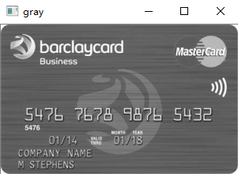

2. 礼帽操作

经过这两个步骤处理，图片中的数字的干扰项降低了许多。

突出数字的明亮度，为了将数字连到一起

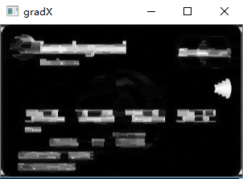

通过两次闭操作，得到了想要的的数字块

画出各个轮廓，观察图片。目标数字的各个轮廓有差不多比例。我们只要遍历各个轮廓，然后进行比例对比。我们可以得到4个数字组，如下图所示

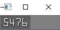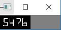

接着我们在从这个数字组中遍历每一个数字

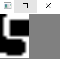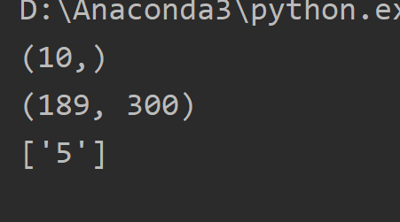

然后与模板中的数字进行匹配，得到最合适的数字。以此类推

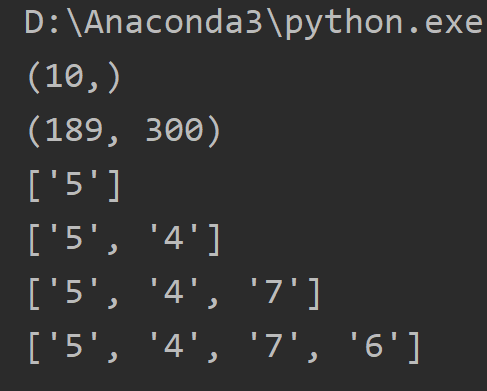

每一组，每一组计算过后，输出最终结果

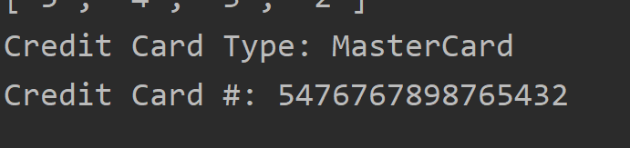

